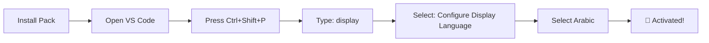

<div align="center">

# 🌐 Arabic Language Pack for VS Code

<div align="center">


[](LICENSE.md)

</div>

### The Arabic Language Pack provides a localized user interface experience for **Visual Studio Code**

<div align="center">


</div>

---

</div>

## 📋 Table of Contents

<div align="center">

| Section | Description |
|:-------:|:-----------|
| [🌟 Overview](#-overview) | Learn about the Arabic Language Pack |
| [✨ Features](#-features) | Discover what the pack offers |
| [📥 Installation](#-installation) | How to install the pack |
| [🚀 Usage](#-usage) | Comprehensive usage guide |
| [⌨️ Useful Shortcuts](#-useful-shortcuts) | Quick shortcuts |
| [🤝 Contributing](#-contributing) | How to contribute to development |
| [📞 Support](#-support) | Support and help links |

</div>

---

<div align="center">

# 🌟 Overview

<div style="background: linear-gradient(135deg, #667eea 0%, #764ba2 100%); padding: 20px; border-radius: 10px; color: white;">

> **Arabic Language Pack** is a comprehensive extension for Visual Studio Code that provides a complete Arabic user interface experience.

</div>

### 🎯 Why Arabic Language Pack?

</div>

<div align="center">

| Feature | Description |
|:-------:|:-----------|
| 🌍 | **Comprehensive Translation** - Complete coverage of VS Code interface |
| 🔄 | **Continuous Updates** - Regular translation updates |
| 📦 | **Easy Installation** - Quick and simple installation |
| 🎨 | **Full Compatibility** - Support for all extensions |
| 👥 | **Strong Community** - Active support from the Arabic community |

</div>

---

<div align="center">

# ✨ Features

</div>

### 1️⃣ Comprehensive User Interface Translation

<div align="center">

```bash
┌─────────────────────────────────────────┐
│  🎨 Translation of menus and toolbars   │
│  📝 Translation of messages and notifications │
│  ⚙️ Translation of settings and options │
│  🔧 Translation of tools and menus      │
└─────────────────────────────────────────┘
```

</div>

### 2️⃣ Built-in Extension Support

<details>
<summary><b>📁 Supported Extensions (Click to View)</b></summary>

<div align="center">

| Category | Number of Extensions |
|:--------:|:--------------------:|
| 🎨 Editors | 10+ |
| 🐛 Debugging | 5+ |
| 🌐 Languages | 15+ |
| ⚙️ Settings | 20+ |
| 🎨 Themes | 10+ |

</div>

</details>

### 3️⃣ Regular Updates

<div align="center">

```bash
┌─────────────────────────────────────────┐
│  🔄 Regular translation updates        │
│  🆕 Adding new features               │
│  🐛 Bug fixes                         │
│  📊 Performance improvements          │
└─────────────────────────────────────────┘
```

</div>

---

<div align="center">

# 📥 Installation

</div>

### 🛒 From VS Code Marketplace

<div align="center">

<div style="background: linear-gradient(135deg, #667eea 0%, #764ba2 100%); padding: 20px; border-radius: 10px; color: white;">

```
1️⃣ Open VS Code
2️⃣ Press Ctrl+Shift+X (or Cmd+Shift+X on Mac)
3️⃣ Search for "Arabic Language Pack"
4️⃣ Click "Install" ✅
```

</div>

</div>

### 📦 From VSIX File

<div align="center">

<div style="background: linear-gradient(135deg, #f093fb 0%, #f5576c 100%); padding: 20px; border-radius: 10px; color: white;">

```
1️⃣ Download the .vsix file from the link below
2️⃣ Open VS Code
3️⃣ Press Ctrl+Shift+P (or Cmd+Shift+P on Mac)
4️⃣ Type "Extensions: Install from VSIX"
5️⃣ Select the downloaded file ✅
```

</div>

</div>

<div align="center">

[](https://marketplace.visualstudio.com/items?itemName=Arabic-language.vscode-ar)

</div>

---

<div align="center">

# 🚀 Usage

</div>

### 🎬 Activating Arabic Language



### 📝 Detailed Steps

<div align="center">

| Step | Action |
|:----:|:-------|
| 1️⃣ | Press `Ctrl+Shift+P` to open the **Command Palette** |
| 2️⃣ | Start typing `display` to filter and show the **Configure Display Language** command |
| 3️⃣ | Press `Enter` and a list of installed languages will appear |
| 4️⃣ | Select **Arabic** to change the user interface language |
| 5️⃣ | Restart VS Code to apply the changes |

</div>

### 📖 More Information

<div align="center">

[](https://go.microsoft.com/fwlink/?LinkId=761051)

</div>

---

<div align="center">

# ⌨️ Useful Shortcuts

</div>

<div align="center">

| Action | Shortcut |
|:------:|:--------:|
| Open Command Palette | `Ctrl+Shift+P` |
| Open Settings | `Ctrl+,` |
| Open Command Palette (Mac) | `Cmd+Shift+P` |
| Reload VS Code | `Ctrl+Shift+P` → "Developer: Reload Window" |

</div>

---

<div align="center">

# 🤝 Contributing

<div style="background: linear-gradient(135deg, #667eea 0%, #764ba2 100%); padding: 30px; border-radius: 15px; color: white; margin-bottom: 20px;">

### We welcome your contributions! 🙌

</div>

</div>

<div align="center">

| Contribution Type | Link |
|:----------------:|:----:|
| 🐛 Report an Issue | [Open Issue](https://github.com/almhajer/Arabic-for-visual-studio-code/issues/new) |
| 💡 Request a Feature | [Request Feature](https://github.com/almhajer/Arabic-for-visual-studio-code/compare) |
| 🔧 Contribute Code | [Open Pull Request](https://github.com/almhajer/Arabic-for-visual-studio-code/pulls) |

</div>

### 📝 Important Notes

<div style="background: linear-gradient(135deg, #ffecd2 0%, #fcb69f 100%); padding: 20px; border-radius: 10px; border-left: 5px solid #f5576c;">

> Translation strings are maintained on Microsoft's translation platform. Changes can only be made on the translation platform and then exported to the **vscode-loc** repository. Therefore, pull requests will not be accepted in the **vscode-loc** repository.

To provide feedback on improving translations, please create an issue in the [vscode-loc](https://github.com/microsoft/vscode-loc) repository.

</div>

---

<div align="center">

# 📞 Support

</div>

### 👥 Main Contributors

<div align="center">

<div style="display: flex; flex-wrap: wrap; justify-content: center; gap: 20px; margin: 20px 0;">

<div style="background: linear-gradient(135deg, #667eea 0%, #764ba2 100%); padding: 20px; border-radius: 15px; color: white; min-width: 200px; box-shadow: 0 10px 30px rgba(0,0,0,0.2);">

| Contributor | Role |
|:-----------:|:----:|
| **Bashir Al-Hassan** | 👨‍💻 Lead Developer |

</div>

<div style="background: linear-gradient(135deg, #f093fb 0%, #f5576c 100%); padding: 20px; border-radius: 15px; color: white; min-width: 200px; box-shadow: 0 10px 30px rgba(0,0,0,0.2);">

| Contributor | Role |
|:-----------:|:----:|
| **Abdulkafi Al-Hassan** | 👨‍💻 Lead Developer |

</div>

<div style="background: linear-gradient(135deg, #4facfe 0%, #00f2fe 100%); padding: 20px; border-radius: 15px; color: white; min-width: 200px; box-shadow: 0 10px 30px rgba(0,0,0,0.2);">

| Contributor | Role |
|:-----------:|:----:|
| **Shukri Al-Hassan** | 👨‍💻 Lead Developer |

</div>

<div style="background: linear-gradient(135deg, #43e97b 0%, #38f9d7 100%); padding: 20px; border-radius: 15px; color: white; min-width: 200px; box-shadow: 0 10px 30px rgba(0,0,0,0.2);">

| Contributor | Role |
|:-----------:|:----:|
| **Abdulqadir Al-Hassan** | 👨‍💻 Lead Developer |

</div>

</div>

</div>

<div align="center">

<div style="background: linear-gradient(135deg, #ff9a9e 0%, #fecfef 99%, #fecfef 100%); padding: 25px; border-radius: 15px; margin: 20px 0;">

> 💚 **Trust in Allah and start with His blessings!** 
> 
> Prayers for my parents and all Muslims.

</div>

</div>

### 🌐 Useful Links

<div align="center">

| Link | Description |
|:----:|:-----------|
| [](https://almhajer.github.io/GraphicsProgrammingAtlas) | Official Website |
| [](https://marketplace.visualstudio.com/publishers/Arabic-language) | Publisher Page |

</div>

---

### 📦 All 4Techs Team Extensions

<div align="center">

<div style="background: linear-gradient(135deg, #667eea 0%, #764ba2 100%); padding: 30px; border-radius: 15px; color: white; margin: 20px 0;">

**Discover the complete set of Arabic extensions from 4Techs!**

</div>

</div>

<div align="center">

| Extension | Description | Version | Link |
|:---------:|:-----------|:--------:|:----:|
| 🌐 **Arabic Language Pack** | Arabic Language Pack for VS Code | 0.0.15 | [VS Marketplace](https://marketplace.visualstudio.com/items?itemName=Arabic-language.vscode-ar) |
| 🌐 **Arabic To HTML** | HTML programming in Arabic | - | [VS Marketplace](https://marketplace.visualstudio.com/items?itemName=Arabic-language.arabictohtml) |
| 🔄 **Auto Language** | Automatic language switcher | - | [VS Marketplace](https://marketplace.visualstudio.com/items?itemName=Arabic-language.autolanguage) |
| 🖥️ **4Techs Arabic Tools** | Integrated Arabic tools | - | [VS Marketplace](https://marketplace.visualstudio.com/publishers/Arabic-language) |
| 🖥️ **4Techs Arabic Tools** | 🔧 Arabic CMake Tools | - | [VS Marketplace](https://marketplace.visualstudio.com/items?itemName=Arabic-language.cmake-tools-arabic) |

</div>

---

### 🌐 Visit Software Store

<div align="center">

<div style="background: linear-gradient(135deg, #667eea 0%, #764ba2 100%); padding: 30px; border-radius: 15px; color: white; margin: 20px 0;">

**Discover more Arabic software and tools on our website**

</div>

<div style="margin: 20px 0;">

[](https://almhajer.github.io/GraphicsProgrammingAtlas)
[](https://marketplace.visualstudio.com/publishers/Arabic-language)

</div>

<div style="background: linear-gradient(135deg, #ffecd2 0%, #fcb69f 100%); padding: 20px; border-radius: 10px; border-left: 5px solid #f5576c;">

> 💡 **Tip:** Visit our website to discover more useful software and tools for Arabic developers.

</div>

</div>

---

<div align="center">

# 📄 License

</div>

<div align="center">

<div style="background: linear-gradient(135deg, #667eea 0%, #764ba2 100%); padding: 20px; border-radius: 10px; color: white;">

```bash
MIT License

This project is licensed under the MIT License
See LICENSE file for details
```

</div>

</div>

---

<div align="center">

<div style="background: linear-gradient(135deg, #667eea 0%, #764ba2 100%); padding: 40px; border-radius: 20px; color: white; margin: 30px 0;">

### 🌟 If you like the project, don't forget to add a ⭐!

---

**Made with ❤️ for the Arabic Community**

<div style="margin-top: 20px;">

[](https://almhajer.github.io/GraphicsProgrammingAtlas)
[](https://marketplace.visualstudio.com/publishers/Arabic-language)

</div>

</div>

---

<div align="center">

<div style="background: linear-gradient(135deg, #ff9a9e 0%, #fecfef 99%, #fecfef 100%); padding: 20px; border-radius: 10px;">

**Thank you for using the Arabic Language Pack!** 🎉

</div>

</div>

---

</div>
