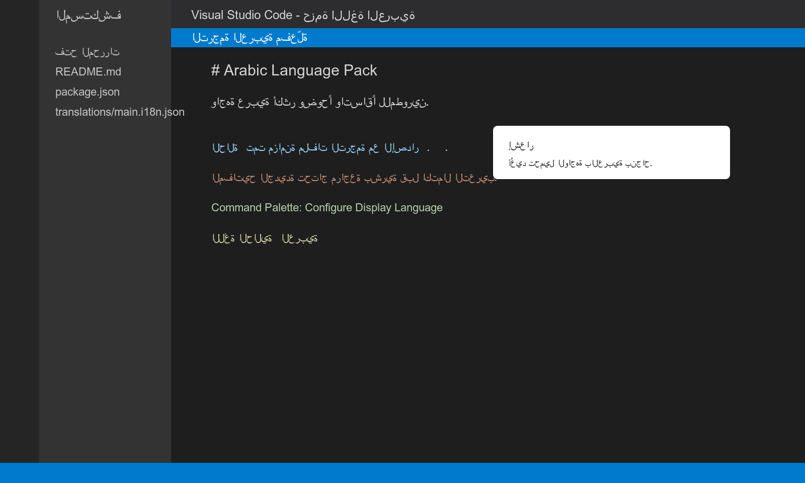

# Arabic Language Pack for Visual Studio Code

Arabic localization for Visual Studio Code, kept in sync with the latest Microsoft language-pack sources.

## Impact

| Metric | Value |
| --- | ---: |
| Total Downloads | 16,757 |
| Downloads Last 30 Days | 1,685 |
| Releases | 7 |

The extension continues to serve Arabic-speaking developers who want a more accessible Visual Studio Code interface without losing compatibility with upstream releases.

## Screenshots

## Features

- Latest upstream localization structure from Microsoft.
- Coverage for the VS Code workbench and bundled extensions.
- Consistent Arabic terminology for UI-facing strings.
- Validation scripts for JSON, localization integrity, and packaging.

## Installation

1. Open the Extensions view in Visual Studio Code.
2. Search for `Arabic Language Pack`.
3. Install the extension published by `Arabic-language`.
4. Run `Configure Display Language`.
5. Select `العربية` and reload VS Code.

## Usage

- Open the Command Palette with `Ctrl+Shift+P` or `Cmd+Shift+P`.
- Run `Configure Display Language`.
- Choose Arabic and restart if prompted.

## Contributing

Please read [CONTRIBUTING.md](./CONTRIBUTING.md) before making translation or tooling changes.

## Security

Please use the private reporting guidance in [SECURITY.md](./SECURITY.md).

## Release Process

1. Sync the repository with the latest `vscode-loc` French package.
2. Review imported keys and finish missing Arabic translations.
3. Run JSON, markdown, localization, and packaging validation.
4. Update `CHANGELOG.md`.
5. Package and publish the extension.

## Roadmap

- Finish the newly imported untranslated keys.
- Automate upstream sync reporting.
- Add CI validation for packaging and markdown quality.
- Improve reviewer guidance for terminology consistency.

## License

MIT. See [LICENSE.md](./LICENSE.md).
