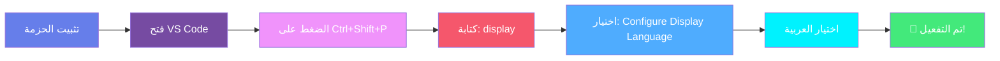

<div align="center">

# 🌐 اللغة العربية لـ VS Code

<div align="center">


</div>

### حزمة اللغة العربية توفر تجربة واجهة مستخدم محلية لـ **Visual Studio Code**

<div align="center">


</div>

---

</div>

## 📋 جدول المحتويات

<div align="center">

| القسم | الوصف |
|:-----:|:------|
| [🌟 نظرة عامة](#-نظرة-عامة) | تعرف على حزمة اللغة العربية |
| [✨ المميزات](#-المميزات) | اكتشف ما تقدمه الحزمة |
| [📥 التثبيت](#-التثبيت) | كيفية تثبيت الحزمة |
| [🚀 الاستخدام](#-الاستخدام) | دليل الاستخدام الشامل |
| [⌨️ اختصارات مفيدة](#-اختصارات-مفيدة) | اختصارات سريعة |
| [🤝 المساهمة](#-المساهمة) | كيف تساهم في التطوير |
| [📞 الدعم](#-الدعم) | روابط الدعم والمساعدة |

</div>

---

<div align="center">

# 🌟 نظرة عامة

<div style="background: linear-gradient(135deg, #667eea 0%, #764ba2 100%); padding: 20px; border-radius: 10px; color: #333;">

> **حزمة اللغة العربية** هي إضافة متكاملة لـ Visual Studio Code توفر تجربة واجهة مستخدم عربية كاملة.

</div>

### 🎯 لماذا حزمة اللغة العربية؟

</div>

<div align="center">

| الميزة | الوصف |
|:------:|:------|
| 🌍 | **ترجمة شاملة** - تغطية كاملة لواجهة VS Code |
| 🔄 | **تحديث مستمر** - تحديثات دورية للترجمة |
| 📦 | **سهولة التثبيت** - تثبيت سريع وبسيط |
| 🎨 | **توافق كامل** - دعم جميع الإضافات |
| 👥 | **مجتمع قوي** - دعم نشط من المجتمع العربي |

</div>

---

<div align="center">

# ✨ المميزات

</div>

### 1️⃣ ترجمة شاملة لواجهة المستخدم

<div align="center">

<div style="background: linear-gradient(135deg, #667eea 0%, #764ba2 100%); padding: 25px; border-radius: 15px; color: white; box-shadow: 0 10px 30px rgba(0,0,0,0.2); margin: 20px 0;">

| الميزة |
|:------|
| 🎨 ترجمة القوائم والأشرطة |
| 📝 ترجمة الرسائل والإشعارات |
| ⚙️ ترجمة الإعدادات والخيارات |
| 🔧 ترجمة الأدوات والقوائم |

</div>

</div>

### 2️⃣ دعم الإضافات المدمجة

<details>
<summary><b>📁 الإضافات المدعومة (اضغط للعرض)</b></summary>

<div align="center">

| الفئة | عدد الإضافات |
|:-----:|:------------:|
| 🎨 المحررات | 10+ |
| 🐛 التصحيح | 5+ |
| 🌐 اللغات | 15+ |
| ⚙️ الإعدادات | 20+ |
| 🎨 السمات | 10+ |

</div>

</details>

### 3️⃣ تحديثات دورية

<div align="center">

<div style="background: linear-gradient(135deg, #f093fb 0%, #f5576c 100%); padding: 25px; border-radius: 15px; color: white; box-shadow: 0 10px 30px rgba(0,0,0,0.2); margin: 20px 0;">

| الميزة |
|:------|
| 🔄 تحديثات منتظمة للترجمة |
| 🆕 إضافة ميزات جديدة |
| 🐛 إصلاح الأخطاء |
| 📊 تحسين الأداء |

</div>

</div>

---

<div align="center">

# 📥 التثبيت

</div>

### 🛒 من VS Code Marketplace

<div align="center">

<div style="background: linear-gradient(135deg, #667eea 0%, #764ba2 100%); padding: 20px; border-radius: 10px; color: #333;">

```
1️⃣ افتح VS Code
2️⃣ اضغط Ctrl+Shift+X (أو Cmd+Shift+X على Mac)
3️⃣ ابحث عن "Arabic Language Pack"
4️⃣ اضغط "Install" ✅
```

</div>

</div>

### 📦 من ملف VSIX

<div align="center">

<div style="background: linear-gradient(135deg, #f093fb 0%, #f5576c 100%); padding: 20px; border-radius: 10px; color: #333;">

```
1️⃣ حمّل ملف .vsix من الرابط أدناه
2️⃣ افتح VS Code
3️⃣ اضغط Ctrl+Shift+P (أو Cmd+Shift+P على Mac)
4️⃣ اكتب "Extensions: Install from VSIX"
5️⃣ اختر الملف المحمّل ✅
```

</div>

</div>

<div align="center">

[](https://marketplace.visualstudio.com/items?itemName=Arabic-language.vscode-ar)

</div>

---

<div align="center">

# 🚀 الاستخدام

</div>

### 🎬 تفعيل اللغة العربية



### 📝 خطوات التفصيلية

<div align="center">

| الخطوة | الإجراء |
|:------:|:--------|
| 1️⃣ | اضغط على `Ctrl+Shift+P` لفتح **لوحة الأوامر** |
| 2️⃣ | ابدأ بكتابة `display` لتصفية وعرض أمر **تكوين لغة العرض** |
| 3️⃣ | اضغط على `Enter` وستظهر قائمة باللغات المثبتة |
| 4️⃣ | اختر **العربية** لتغيير لغة واجهة المستخدم |
| 5️⃣ | أعد تشغيل VS Code لتفعيل التغييرات |

</div>

### 📖 مزيد من المعلومات

<div align="center">

[](https://go.microsoft.com/fwlink/?LinkId=761051)

</div>

---

<div align="center">

# ⌨️ اختصارات مفيدة

</div>

<div align="center">

| الإجراء | الاختصار |
|:-------:|:--------:|
| فتح لوحة الأوامر | `Ctrl+Shift+P` |
| فتح الإعدادات | `Ctrl+,` |
| فتح لوحة الأوامر (Mac) | `Cmd+Shift+P` |
| إعادة تشغيل VS Code | `Ctrl+Shift+P` → "Developer: Reload Window" |

</div>

---

<div align="center">

# 🤝 المساهمة

<div style="background: linear-gradient(135deg, #667eea 0%, #764ba2 100%); padding: 30px; border-radius: 15px; color: #333; margin-bottom: 20px;">

### نرحب بمساهماتكم! 🙌

</div>

</div>

<div align="center">

| نوع المساهمة | الرابط |
|:------------:|:------:|
| 🐛 الإبلاغ عن مشكلة | [فتح Issue](https://github.com/almhajer/Arabic-for-visual-studio-code/issues/new) |
| 💡 طلب ميزة جديدة | [طلب Feature](https://github.com/almhajer/Arabic-for-visual-studio-code/compare) |
| 🔧 المساهمة في الكود | [فتح Pull Request](https://github.com/almhajer/Arabic-for-visual-studio-code/pulls) |

</div>

### 📝 ملاحظات هامة

<div style="background: linear-gradient(135deg, #ffecd2 0%, #fcb69f 100%); padding: 20px; border-radius: 10px; border-left: 5px solid #f5576c;">

> يتم صيانة سلاسل الترجمة في منصة الترجمة التابعة لمايكروسوفت. يمكن إجراء التغييرات فقط في منصة الترجمة ثم تصديرها إلى مستودع **vscode-loc**. لذلك، لن يتم قبول طلبات السحب (pull requests) في مستودع **vscode-loc**.

لإبداء ملاحظات حول تحسين الترجمة، يرجى إنشاء قضية في مستودع [vscode-loc](https://github.com/microsoft/vscode-loc).

</div>

---

<div align="center">

# 📞 الدعم

</div>

### 👥 المساهمون الرئيسيون

<div align="center">

<div style="display: flex; flex-wrap: wrap; justify-content: center; gap: 20px; margin: 20px 0;">

<div style="background: linear-gradient(135deg, #667eea 0%, #764ba2 100%); padding: 20px; border-radius: 15px; color: #333; min-width: 200px; box-shadow: 0 10px 30px rgba(0,0,0,0.2);">

| المساهم | الدور |
|:-------:|:-----:|
| **بشير الحسن** | 👨‍💻 مطور رئيسي |

</div>

<div style="background: linear-gradient(135deg, #f093fb 0%, #f5576c 100%); padding: 20px; border-radius: 15px; color: #333; min-width: 200px; box-shadow: 0 10px 30px rgba(0,0,0,0.2);">

| المساهم | الدور |
|:-------:|:-----:|
| **عبدالكافي الحسن** | 👨‍💻 مطور رئيسي |

</div>

<div style="background: linear-gradient(135deg, #4facfe 0%, #00f2fe 100%); padding: 20px; border-radius: 15px; color: #333; min-width: 200px; box-shadow: 0 10px 30px rgba(0,0,0,0.2);">

| المساهم | الدور |
|:-------:|:-----:|
| **شكري الحسن** | 👨‍💻 مطور رئيسي |

</div>

<div style="background: linear-gradient(135deg, #43e97b 0%, #38f9d7 100%); padding: 20px; border-radius: 15px; color: #333; min-width: 200px; box-shadow: 0 10px 30px rgba(0,0,0,0.2);">

| المساهم | الدور |
|:-------:|:-----:|
| **عبدالقادر الحسن** | 👨‍💻 مطور رئيسي |

</div>

</div>

</div>

<div align="center">

<div style="background: linear-gradient(135deg, #ff9a9e 0%, #fecfef 99%, #fecfef 100%); padding: 25px; border-radius: 15px; margin: 20px 0;">

> 💚 **توكل على الله وابدأ على بركته!** 
> 
> الدعاء لوالدي ولجميع المسلمين.

</div>

</div>

### 🌐 روابط مفيدة

<div align="center">

| الرابط | الوصف |
|:------:|:------|
| [](http://www.4Techs.net) | الموقع الرسمي |
| [](https://marketplace.visualstudio.com/publishers/Arabic-language) | صفحة الناشر |

</div>

---

### 📦 جميع إضافات فريق 4Techs

<div align="center">

<div style="background: linear-gradient(135deg, #667eea 0%, #764ba2 100%); padding: 30px; border-radius: 15px; color: #333; margin: 20px 0;">

**اكتشف مجموعة الإضافات العربية المتكاملة من 4Techs!**

</div>

</div>

<div align="center">

| الإضافة | الوصف | الإصدار | الرابط |
|:-------:|:------|:-------:|:------:|
| 🌐 **Arabic Language Pack** | حزمة اللغة العربية لـ VS Code | 0.0.6 | [VS Marketplace](https://marketplace.visualstudio.com/items?itemName=Arabic-language.vscode-ar) |
| 🌐 **Arabic To HTML** | برمجة صفحات HTML بالعربي | - | [VS Marketplace](https://marketplace.visualstudio.com/items?itemName=Arabic-language.arabictohtml) |
| 🔄 **Auto Language** | مبدل اللغة التلقائي | - | [VS Marketplace](https://marketplace.visualstudio.com/items?itemName=Arabic-language.autolanguage) |
| 🖥️ **4Techs Arabic Tools** | أدوات عربية متكاملة | - | [VS Marketplace](https://marketplace.visualstudio.com/publishers/Arabic-language) |

</div>

---

### 🌐 زيارة متجر البرامج

<div align="center">

<div style="background: linear-gradient(135deg, #667eea 0%, #764ba2 100%); padding: 30px; border-radius: 15px; color: #333; margin: 20px 0;">

**اكتشف المزيد من البرامج والأدوات العربية على موقعنا**

</div>

<div style="margin: 20px 0;">

[](http://www.4tiko.net)

</div>

<div style="background: linear-gradient(135deg, #ffecd2 0%, #fcb69f 100%); padding: 20px; border-radius: 10px; border-left: 5px solid #f5576c;">

> 💡 **نصيحة:** قم بزيارة موقعنا لاكتشاف المزيد من البرامج والأدوات المفيدة للمطورين العرب.

</div>

</div>

---

<div align="center">

# 📄 الترخيص

</div>

<div align="center">

<div style="background: linear-gradient(135deg, #667eea 0%, #764ba2 100%); padding: 20px; border-radius: 10px; color: #333;">

```bash
MIT License

هذا المشروع مرخص تحت رخصة MIT
راجع ملف LICENSE للتفاصيل
```

</div>

</div>

---

<div align="center">

<div style="background: linear-gradient(135deg, #667eea 0%, #764ba2 100%); padding: 40px; border-radius: 20px; color: #333; margin: 30px 0;">

### 🌟 إذا أعجبك المشروع، لا تنسَ إضافة ⭐!

---

**صنع بـ ❤️ للمجتمع العربي**

<div style="margin-top: 20px;">

[](http://www.4Techs.net)
[](https://marketplace.visualstudio.com/publishers/Arabic-language)

</div>

</div>

---

<div align="center">

<div style="background: linear-gradient(135deg, #ff9a9e 0%, #fecfef 99%, #fecfef 100%); padding: 20px; border-radius: 10px;">

**شكراً لاستخدامك حزمة اللغة العربية!** 🎉

</div>

</div>

---

</div>